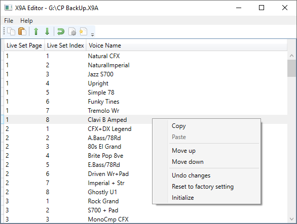

# X9A Editor

Tool to inspect, edit and merge Yamaha CP88/CP73 backup files (.X9A)

**Disclaimer:** this is an unofficial tool and as such not supported by Yamaha. Use this software at your own risk. Always keep backups of files you edit.

## Features
- View and edit voice names
- Reorder and copy voices between backups
- Reset voices to their factory default
- Compatible with firmware versions 1.20, 1.30, 1.31 (older or newer versions may work but are untested)

While all functionality this tool currently provides is also available on the instrument itself, it is very tedious to make bigger customizations on the instrument directly.
This tool provides a quick and easy way to rename, recorder and merge voices from one or more backups.

## Usage

Usage should be largely self-explanatory. To merge multiple X9A files, open each in a separate instance of the tool. You can then select and copy voices in one instance and paste them into the other.

## X9A file format
The structure of X9A files is not officially documented. You can find a mostly complete but unofficial specification in [X9A file format.md](X9A%20file%20format.md).
See also https://gist.github.com/arachsys/2883877 for documentation on an older variant of the format.

## License
MIT, see [LICENSE.md](LICENSE.md)

Uses parts of the [Silk icon set](http://www.famfamfam.com/lab/icons/silk/).
